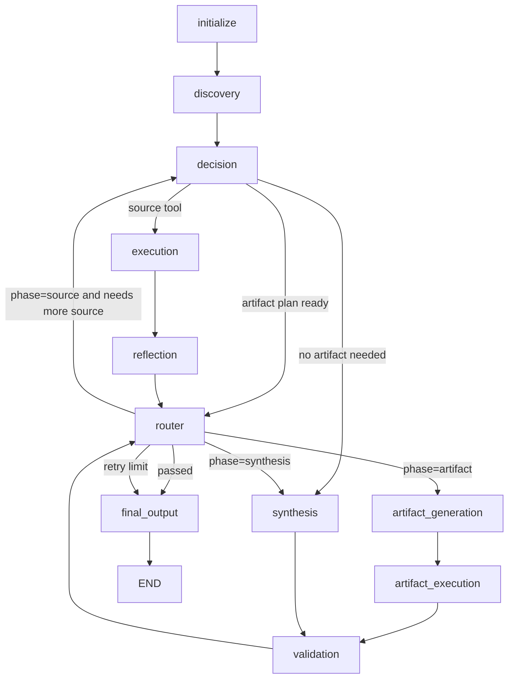

# Agent Graph Redesign

## Purpose

This document defines the target architecture for the SolidCue LangGraph agent flow.

The current graph fails because multiple nodes write the same state keys with different meanings. Validation, reflection, decision, synthesis, and artifact generation can route into each other while overwriting shared state such as `decision`, `draft_output`, `retry_reason`, and `finalization_reason`.

The redesign introduces explicit phases, single-writer state partitions, and deterministic routing.

## Design Goals

- Keep source gathering, artifact generation, artifact execution, synthesis, and final output as separate phases.
- Ensure each durable state key has exactly one owner.
- Make source evidence append-only.
- Keep artifact generation and artifact execution separate because LLM generation and tool execution have different failure modes.
- Move all routing authority into one deterministic router.
- Make validation produce typed failure information only; validation must not route.
- Remove generic scratch state that changes meaning across phases.

## Target Workflow

```text
initialize
-> discovery
-> decision
-> execution
-> reflection
-> router
-> artifact_generation
-> artifact_execution
-> validation
-> synthesis
-> final_output
```

The graph has three scoped loops:

```text
source loop:
decision -> execution -> reflection -> router

artifact loop:
artifact_generation -> artifact_execution -> validation -> router

synthesis loop:
synthesis -> validation -> router
```

## Mermaid Flow



## Router Dispatch Contract

The router is the only node that may dispatch based on `failure_type` and `phase`.

| failure_type | phase | dispatch |
|---|---|---|
| `null` | `source` | `synthesis` or `artifact_generation`, depending on requested output |
| `null` | `artifact` | `synthesis` |
| `null` | `synthesis` | `final_output` |
| `missing_source` | any | `decision` |
| `bad_artifact` | any | `artifact_generation` |
| `not_executed` | any | `artifact_execution` |
| `bad_synthesis` | any | `synthesis` |
| `retry_limit` | any | `final_output` with failure status |

The router owns phase transitions. Other nodes may read `phase`, but must not mutate it.

## State Model

### Durable State Keys

| key | owner | behavior |
|---|---|---|
| `phase` | router | Current phase: `source`, `artifact`, `synthesis`, or `final`. Read-only for all other nodes. |
| `source_manifest` | execution/source indexer | List of known source files and read status. Tracks `listed`, `reading`, `read`, and `failed`. |
| `source_evidence` | execution | Append-only source content. Never overwritten. Artifact and synthesis nodes only read it. |
| `artifact_plan` | decision | Structured plan for the requested artifact. Locked once written for a logical artifact attempt. |
| `artifact_input` | artifact_generation | Tool arguments/content generated for the artifact. May be overwritten only inside artifact retry loop. |
| `artifact_result` | artifact_execution | Output from artifact tool execution. May be overwritten only inside artifact retry loop. |
| `synthesis_draft` | synthesis | User-facing response draft. Only synthesis writes this. |
| `failure_type` | validation | Enum used by router: `missing_source`, `bad_artifact`, `not_executed`, `bad_synthesis`, or `null`. |
| `validation_report` | validation | Human/debug detail. Router must not inspect this for dispatch. |
| `final_response` | final_output | Terminal response. Written once. |

### Removed State Keys

These keys should be removed from the redesigned graph because they caused collisions or ambiguous routing:

```text
retry_reason
finalization_reason
latest_output
draft_output
artifact_selection_reason
tool_use
reflection_result
decision as a shared routing object
```

`decision` output should be written directly into the state partition it owns for the current phase, for example `artifact_plan`, not into a generic shared `decision` slot.

## Node Responsibilities

### initialize

Sets safe defaults only.

Allowed writes:

```text
phase initial value if absent
source_manifest initial value if absent
source_evidence initial empty list if absent
attempt counters if used
metadata defaults
```

Must not write artifact or synthesis state.

### discovery

Extracts static agent/persona/source configuration.

Allowed writes:

```text
metadata
source path hints
```

Discovery should not mark files as read and should not write `source_evidence`.

### decision

Plans the next logical source or artifact step.

Allowed writes:

```text
artifact_plan
source tool intent for execution
```

Decision must not write:

```text
synthesis_draft
final_response
failure_type
artifact_input
artifact_result
source_evidence
```

Decision should not be used as a catch-all retry target. The router should route to decision only when the source loop genuinely needs a new source tool call or source plan.

### execution

Runs source/context tools only in the source loop.

Allowed writes:

```text
source_manifest
source_evidence
source execution diagnostics if needed
```

Rules:

- `source_evidence` is append-only.
- Listing tools update `source_manifest` with discovered files.
- Reading/downloading tools append material content to `source_evidence`.
- Successful source reads update the corresponding manifest entry to `read`.
- Failed source reads update the corresponding manifest entry to `failed`.

Execution must not write artifact state.

### reflection

Determines whether source gathering is sufficient.

Allowed output:

```text
sufficient: boolean
```

Reflection must not route and must not write durable graph state except its direct node output for router consumption.

Reflection should distinguish:

```text
file listing metadata != material source content
browser/page metadata != visible page/source text
```

### router

Owns all deterministic dispatch and phase transitions.

Allowed writes:

```text
phase
retry counters if used
failure status on terminal retry limit
```

Router reads:

```text
phase
failure_type
source_manifest
source_evidence availability
artifact_result availability
retry counters
```

Router must not inspect `validation_report` for dispatch.

### artifact_generation

LLM-only node that converts `artifact_plan` and `source_evidence` into artifact tool arguments/content.

Allowed writes:

```text
artifact_input
```

Preconditions:

```text
phase == artifact
artifact_plan exists
source_evidence is sufficient or source loop has been explicitly waived
failure_type in {null, bad_artifact, not_executed}
```

Must not execute tools.

Must not write:

```text
source_evidence
artifact_result
synthesis_draft
final_response
```

### artifact_execution

Tool-only node that executes the artifact tool using `artifact_input`.

Allowed writes:

```text
artifact_result
```

Preconditions:

```text
phase == artifact
artifact_input exists
```

Must not generate artifact content with an LLM.

### validation

Validates either `artifact_result` or `synthesis_draft`, depending on phase.

Allowed writes:

```text
failure_type
validation_report
```

Validation must not route.

Validation must not write:

```text
phase
source_evidence
artifact_input
artifact_result
synthesis_draft
final_response
```

Failure type enum:

```text
missing_source
bad_artifact
not_executed
bad_synthesis
null
```

Example validation output:

```json
{
  "failure_type": "missing_source",
  "validation_report": {
    "reason": "Experience documents were listed but not read.",
    "missing_sources": ["General Assembly", "Continental Automotive"]
  }
}
```

The router reads only `failure_type`.

### synthesis

Creates the user-facing response from durable state.

Allowed writes:

```text
synthesis_draft
```

Rules:

- Reads `source_evidence`, `artifact_plan`, and `artifact_result`.
- Must not write artifact state.
- Must not mutate source state.
- May be retried only for `bad_synthesis`.

### final_output

Terminal node.

Allowed writes:

```text
final_response
workflow_status
```

Must not route or mutate working state.

## Source Manifest Contract

`source_manifest` tracks listed files and read progress.

Example:

```json
{
  "sources": [
    {
      "id": "1lJ6u1cg-CG3DAtGAdYGSprxfY0vDerUNCoSS3OUkU5k",
      "name": "General Assembly",
      "uri": "google-drive://1lJ6u1cg-CG3DAtGAdYGSprxfY0vDerUNCoSS3OUkU5k",
      "mime_type": "application/vnd.google-apps.document",
      "status": "listed",
      "read_attempts": 0
    }
  ]
}
```

Allowed status transitions:

```text
listed -> reading -> read
listed -> reading -> failed
failed -> reading -> read
```

Only the source execution/indexing layer may update source status.

## Artifact Contract

Artifact state is isolated from source and synthesis state.

```text
artifact_plan: what to build
artifact_input: generated tool args/content
artifact_result: tool execution result
```

Artifact generation may overwrite `artifact_input` only inside the artifact retry loop.

Artifact execution may overwrite `artifact_result` only inside the artifact retry loop.

A synthesis retry must not re-run artifact generation unless validation emits `bad_artifact` or `not_executed` and the router explicitly moves phase back to artifact.

## Retry Counters

Use separate counters for scoped loops:

```text
source_attempt
artifact_attempt
synthesis_attempt
```

Do not use a single global `attempt` counter to decide all loop exits.

Recommended behavior:

```text
source_attempt increments on source tool failures or insufficient source loops
artifact_attempt increments on artifact generation/execution/validation failures
synthesis_attempt increments on bad synthesis
```

The router owns retry limit checks and terminal failure dispatch.

## Invariants

These invariants should be enforced by tests:

1. No node except execution/source indexer writes `source_evidence`.
2. `source_evidence` is append-only.
3. No node except synthesis writes `synthesis_draft`.
4. No node except validation writes `failure_type`.
5. Only router reads `failure_type` for dispatch.
6. Artifact generation does not execute tools.
7. Artifact execution does not call an LLM to generate content.
8. Validation never routes.
9. Router owns `phase` transitions.
10. Source listing metadata is not treated as material source evidence.
11. Browser/navigation metadata is not treated as material source evidence.
12. Artifact retries cannot mutate `source_evidence`.
13. Synthesis retries cannot mutate `artifact_input` or `artifact_result`.

## Migration Notes

This redesign should be implemented as a refactor, not as additional patches on the current shared-state graph.

Suggested order:

1. Introduce new state schema with the durable keys above.
2. Add router node and move all route decisions into it.
3. Change validation to emit `failure_type` and `validation_report` only.
4. Split execution paths: source execution writes source state, artifact execution writes artifact state.
5. Change artifact generation to write `artifact_input`, not `decision.tool_input`.
6. Remove `source_selection` and `artifact_selection` rewrite nodes.
7. Remove shared scratch keys after callers stop depending on them.
8. Add invariant tests for state ownership and phase transitions.

## Non-Goals

- Do not optimize node count at the cost of responsibility boundaries.
- Do not merge artifact generation and artifact execution.
- Do not let validation become a router again.
- Do not reintroduce a generic `draft_output` key.
- Do not use `decision` as a shared mutable routing object.
