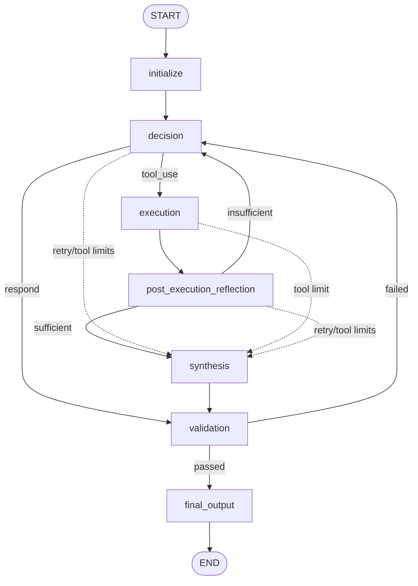

# LangGraph Migration Guide

This document is the system design and migration instruction for moving SolidCue
from the current hand-written workflow loop to a LangGraph workflow.

Do not start migration code from this document alone. Use it as the coding-agent
brief for a future implementation pass.

## Current Workflow

SolidCue currently runs agent orchestration through
`solidcue/core/orchestrator.py::run_workflow`.

The current flow is imperative:

1. Initialize runtime metadata, retry counters, tool counters, and tool history.
2. Set `current_step = "decision"`.
3. Run a `while current_step != "END"` loop.
4. Call node functions manually.
5. Mutate `state` with each node update.
6. Choose the next step with `if` / `elif` branches.
7. Stop after `final_output_node`.

The existing logical nodes are:

- `router_node`: optional agent selection before decision.
- `decision_node`: decide whether to respond directly or call a tool.
- `execution_node`: execute an allowed MCP tool.
- `post_execution_reflection_node`: decide whether tool evidence is sufficient.
- `synthesis_node`: turn raw tool output or final answer material into a draft.
- `validation_node`: validate the draft output.
- `final_output_node`: produce `final_output` and mark completion.

Current state is defined in `solidcue/core/state/schema.py::AgentState`.

## Why Move To LangGraph

LangGraph gives SolidCue a first-class orchestration model instead of encoding
workflow behavior inside one large control loop.

The main advantages are:

- **Explicit graph structure**: nodes and edges make the workflow easier to see,
  test, and modify than nested `if` / `elif` control flow.
- **Conditional edges**: routing decisions such as `decision -> execution` vs
  `decision -> validation` can be modeled as named branch functions.
- **Checkpointing**: graph state can be persisted between steps, enabling resume,
  debugging, replay, and future long-running agent sessions.
- **Interrupts**: future human approval gates can pause before sensitive nodes,
  such as `execution`, without redesigning the workflow.
- **State reducers**: fields like `messages` can use explicit merge behavior
  instead of relying on ad hoc state mutation.
- **Observability**: compiled graphs expose a clearer execution boundary for
  debug output, traces, and future visual graph inspection.
- **Composable growth**: future multi-agent routing, RAG, memory, planning, and
  human-in-the-loop steps can be added as graph nodes instead of widening the
  orchestrator loop.

This migration should preserve the current behavior first. New capabilities
should come only after parity is proven by tests.

## Target Architecture

The target design keeps the existing node files and moves orchestration into a
LangGraph builder under `solidcue/core/graph/`.

Recommended target modules:

```text
solidcue/core/
  graph/
    __init__.py
    builder.py          # builds and compiles the StateGraph
    routing.py          # conditional edge functions
    wrappers.py         # graph node wrappers for counters, limits, and setup
  orchestrator.py       # compatibility wrapper around compiled graph invocation
```

The existing node modules should stay focused on node business logic. Avoid
moving provider, tool, prompt, or validation logic into graph routing code.

## Target Graph



The dotted paths represent existing limit guards that are currently checked at
the top of each loop iteration. In LangGraph, model these as conditional routing
logic, not hidden branching inside unrelated business nodes.

## State Design

Keep `AgentState` as the graph state type unless there is a strong reason to
split input, internal, and output state later.

Important fields:

- `agent_key`, `user_input`, `config`: run input.
- `metadata`: runtime clock, location, and timezone context.
- `messages`: accumulated user, assistant, and tool transcript.
- `llm_prompt_messages`: latest decision-model prompt payload for debug output.
- `decision`, `tool_use`: output from `decision_node`.
- `execution_result`: output from `execution_node`.
- `reflection_result`: output from `post_execution_reflection_node`.
- `draft_output`: candidate user-facing answer.
- `validation_result`: output from `validation_node`.
- `final_output`, `workflow_status`: final response fields.
- `attempt`, `max_retries`, `retry_reason`: retry control.
- `tool_turn_count`, `tool_call_history`: tool-loop control.
- `finalization_reason`: reason for leaving the loop.

`messages` is already annotated with `operator.add`. During migration, verify
whether node functions should return only appended messages or full message
lists. LangGraph reducers append returned values, so returning a full transcript
from `decision_node` may duplicate messages unless wrapped or adjusted.

## Graph Nodes

Use small wrappers where graph lifecycle behavior differs from the current node
functions.

### `initialize`

Responsibilities:

- Add `metadata` if missing.
- Initialize `attempt` to `0`.
- Initialize `tool_turn_count` to `0`.
- Initialize `tool_call_history` to an empty list.
- Preserve caller-provided `max_retries`; default to `3` if absent.

This replaces setup code currently at the top of `run_workflow`.

### `decision`

Use the existing `decision_node`.

After the node runs:

- If `tool_use` is true, route to `execution`.
- Otherwise, ensure direct responses set:
  - `draft_output`
  - `finalization_reason = "decision_responded"`
  - next node `validation`

This direct-response normalization can live in a wrapper so `decision_node`
does not need to know about graph edges.

### `execution`

Use the existing `execution_node`, plus orchestration-side behavior:

- Record the selected tool call before execution.
- Increment `tool_turn_count` after execution.
- Set `retry_reason` when execution fails.
- Increment `attempt` after execution, matching current behavior.

Keep `_record_tool_call` behavior from the current orchestrator.

### `post_execution_reflection`

Use the existing `post_execution_reflection_node`.

Route based on `reflection_result.sufficient`:

- `True`: clear `retry_reason`, build `draft_output` from execution, set
  `finalization_reason = "reflection_sufficient"`, then go to `synthesis`.
- `False`: build a retry reason from `reason` and `missing`, then go back to
  `decision`.

Keep the exact retry reason formatting because
`tests/test_orchestrator.py` depends on it.

### `synthesis`

Use the existing `synthesis_node`.

Route to `validation`.

### `validation`

Use the existing `validation_node`.

Route based on `validation_result.passed`:

- `True`: set `finalization_reason` if missing and go to `final_output`.
- `False`: set `retry_reason`, increment `attempt`, and go back to `decision`.

### `final_output`

Use the existing `final_output_node`.

Route to `END`.

## Conditional Routing

Create routing functions with small, explicit return values.

Suggested route labels:

```text
decision_next:
  - execution
  - validation
  - synthesis
  - final_output

reflection_next:
  - synthesis
  - decision
  - final_output

validation_next:
  - final_output
  - decision
  - synthesis
```

Before routing normal branches, check global limits:

- If `attempt > max_retries`, set:
  - `retry_reason = "Maximum attempts reached."`
  - `finalization_reason = "retry_limit_reached"`
  - next node `final_output`
- If `tool_turn_count >= max_tool_turns` while in a tool-capable phase, set:
  - `retry_reason = "Maximum tool turns reached."`
  - `finalization_reason = "tool_turn_limit_reached"`
  - `draft_output` from the latest execution result
  - next node `synthesis`

Keep `max_tool_turns = 5` for parity unless a separate change updates the
runtime configuration.

## Checkpointing

Start with an in-memory checkpointer during migration:

```python
from langgraph.checkpoint.memory import InMemorySaver

graph = builder.compile(checkpointer=InMemorySaver())
```

Invoke with a stable thread id:

```python
graph.invoke(
    state,
    config={"configurable": {"thread_id": run_id}},
)
```

Recommended `run_id` options:

- CLI single run: generate a UUID per `run-agent` execution.
- Future conversation mode: use a conversation/session id.
- Tests: use deterministic ids such as test names.

Do not introduce persistent storage in the first migration. After graph parity
is proven, add a persistent checkpointer behind a storage abstraction.

## Compatibility Boundary

Keep `solidcue.services.agent_service.run_agent` stable:

```python
agent, result = run_agent(agent_key=agent_key, user_input=prompt, debug=debug)
```

Keep `solidcue.core.orchestrator.run_workflow(state, debug=False)` available as
a compatibility wrapper. Internally it can call the compiled LangGraph app.

This avoids touching CLI behavior during the first migration.

## Migration Plan

### Phase 1: Graph Scaffold

- Add `solidcue/core/graph/builder.py`.
- Add `solidcue/core/graph/routing.py`.
- Add `solidcue/core/graph/wrappers.py` if wrappers are needed.
- Build a `StateGraph(AgentState)` with the target nodes and edges.
- Do not remove `run_workflow`.

### Phase 2: Parity Wrapper

- Update `run_workflow` to invoke the compiled graph.
- Preserve the `debug` parameter.
- Preserve final returned state shape.
- Keep metadata defaults identical.
- Keep retry and tool limit behavior identical.

### Phase 3: Tests

- Update or add tests around graph routing.
- Keep current node tests intact.
- Keep `tests/test_orchestrator.py` behavior passing.
- Add tests for:
  - direct response path
  - tool execution path
  - reflection insufficient retry path
  - validation failure retry path
  - retry limit path
  - tool turn limit path
  - message accumulation without duplication

### Phase 4: Debug And Observability

- Ensure `uv run cli run-agent --debug` still prints:
  - agent config
  - decision
  - execution result
  - validation result
  - accumulated messages
  - latest prompt messages
- Consider adding graph node names to debug output after parity.

### Phase 5: Persistent Checkpoints

Only after parity:

- Decide where checkpoint state belongs under `solidcue/storage/`.
- Add a storage-backed checkpointer.
- Add CLI/session ids for resume.
- Add tests that simulate interruption and resume.

## Coding-Agent Instructions

When implementing the migration later:

1. Start from tests and behavior, not from a rewrite.
2. Preserve existing node functions unless a wrapper is clearly cleaner.
3. Keep orchestration logic in `solidcue/core/graph/`.
4. Keep provider/tool/prompt logic in existing modules.
5. Do not introduce new dependencies; LangGraph is already in `pyproject.toml`.
6. Prefer small route functions over broad generic dispatch.
7. Keep state updates explicit and readable.
8. Be careful with `messages` reducers to avoid duplicated transcript entries.
9. Preserve the public service and CLI contract.
10. Run `uv run pytest` before considering the migration complete.

## Risks And Watchpoints

- **Message duplication**: `AgentState.messages` uses an append reducer. Existing
  nodes often return full lists. This must be handled deliberately.
- **State mutation**: several nodes mutate `state` directly. LangGraph supports
  state updates, but wrappers should avoid surprising shared mutation.
- **Async tool execution**: `execution_node` currently uses `asyncio.run`.
  Migrating to async graph execution may require a separate change.
- **Retry semantics**: `attempt` currently increments after execution and after
  validation failure. Preserve this before improving it.
- **Limit checks**: current limit checks happen before every node branch in the
  loop. The graph migration must not accidentally skip them.
- **Debug output**: CLI debug mode depends on fields produced during the run.
- **Checkpoint config**: checkpointed graphs need a stable `thread_id`.

## Definition Of Done

The migration is complete when:

- `run_workflow(state, debug=False)` still returns the same state shape.
- Existing tests pass.
- New graph routing tests cover all current branches.
- CLI `uv run cli run-agent` works.
- CLI `uv run cli run-agent --debug` still prints useful debug output.
- The old manual `while current_step != "END"` loop is removed or reduced to a
  compatibility wrapper.
- `LANGGRAPH.md` remains accurate after implementation.

