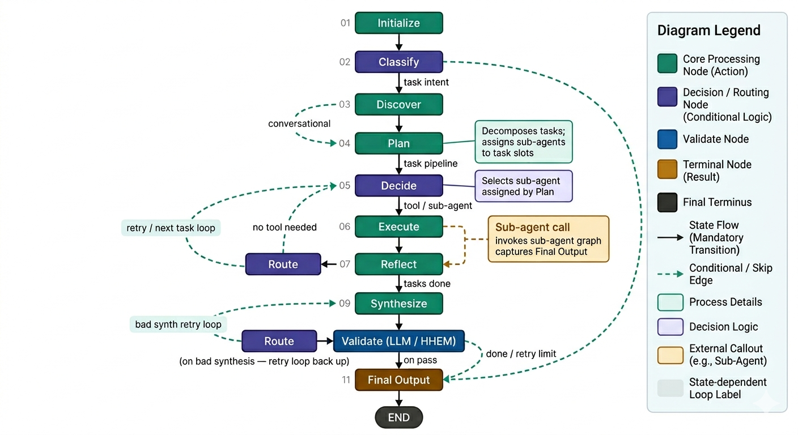
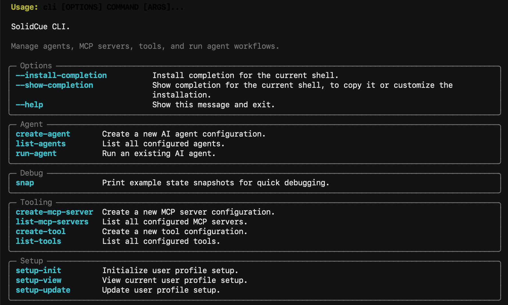
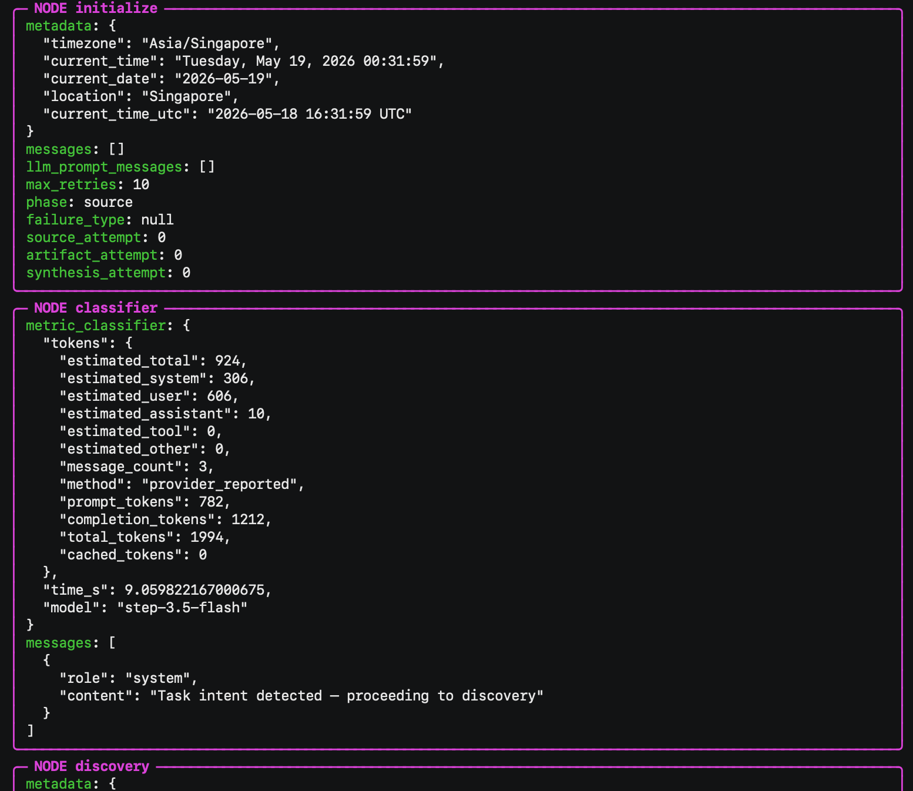

<p align="center">
  <h1>SolidCue - Config-Driven AI Agent Orchestration CLI</h1>
</p>


SolidCue is a Python CLI for building and running config-driven AI agents with
LangGraph. Agents are defined entirely through YAML, covering persona, tools,
MCP servers, provider settings, constraints, and user context, with no
orchestration code required per use case.

The runtime executes a multi-stage graph that classifies the request, discovers
relevant tools, plans an approach, decides on actions, executes tool calls,
reflects on results, validates output quality, and synthesizes a final response,
with routing logic that loops back through stages when gaps are detected.

Observability is supported through Arize Phoenix, LangSmith, and Langfuse,
individually or together.

## Keywords

AI agents, agent orchestration, LangGraph, Arize Phoenix, LangSmith, Langfuse,
Model Context Protocol, MCP, AI CLI, LLM tools, OpenAI-compatible API,
Anthropic Claude, OpenRouter, YAML agent configuration, Python agent framework.

## Why SolidCue

- Build agents without hardcoding orchestration logic per use case
- Keep agent behavior inspectable through YAML and deterministic workflow stages
- Connect external tools through MCP or direct API tool configuration
- Define agent role and tone through PERSONA.md
- Define domain expertise and task knowledge through SKILL.md
- Define tool usage guidance and preferences through TOOLS.md
- Trace full LangGraph runs in Arize Phoenix, LangSmith, or Langfuse when debugging or evaluating behavior

## Architecture Overview

SolidCue orchestrates agent workflows through a LangGraph state graph composed of the following nodes and edges:



### Workflow Stages (Nodes)

1. **Initialize**: load agent config, persona, skill, tools guidance, and user context. Resolve timezone, set retry limits, and prepare baseline state.
2. **Classify**: use a lightweight LLM to determine user intent (greeting, off-topic, conversational, or task). Simple intents are routed directly to output, skipping the full pipeline.
3. **Discover**: extract source and output file paths from SKILL.md and TOOLS.md using LLM-based introspection, so downstream nodes know what files the agent works with.
4. **Plan**: decompose the user request into a structured task plan that drives all downstream nodes. Each task is typed (source gathering, artifact generation, synthesis, or review), carries normalized requirement keys and an evidence role (grounding, alignment, or context). Each task phase is enforced to maintain consistent task shape and act as guardrail to avoid vague requirements.
5. **Decide**: for each task, use the LLM to choose an action: call a specific tool (with validated arguments) or respond directly. Decisions are validated against the agent's allowed tool set.
6. **Execute**: invoke the selected tool via MCP, fill missing arguments from prior task outputs, normalize results, and record success or failure in tool call history.
7. **Reflect**: validate tool output against task requirements. If the planned tool succeeded, requirements are marked met deterministically. Otherwise, an LLM checks whether the output semantically satisfies each requirement.
8. **Route**: the central dispatcher for phase transitions and retries. Checks task completion via accomplishments, advances the task plan when tasks complete, builds retry context when they fail, and enforces retry limits.
9. **Synthesize**: collect evidence from completed tasks, deduplicate and clean it, then use a writer-role LLM to produce a polished response grounded in the gathered material.
10. **Validate (LLM)**: check the synthesis draft for quality using LLM evaluation against the user query and evidence. Scores the draft on pass/fail with a reason and confidence score.
11. **Validate (HHEM)**: optionally score claim-level groundedness using a local HHEM model. Each claim in the draft is scored against source evidence, with LLM fallback to verify borderline failures. Best suited for RAG tool workflows where factual grounding against retrieved documents is critical.
12. **Final Output**: for conversational requests, return the pre-generated response. For tasks, compose the final user-facing output from the validated synthesis draft.

### Routing and Flow (Edges)

Fixed edges define the guaranteed flow between stages:

- Initialize → Classify → (routing decision)
- Discover → Plan → (routing decision)
- Execute → Reflect → Route
- Synthesize → Validate → Route
- Final Output → END

Conditional edges control branching based on state:

- **After Classify**: routes to Discover when a task intent is detected, to Plan for conversational queries, or directly to Final Output for greetings and off-topic input.
- **After Plan**: routes to Decide to begin the task pipeline, or to Final Output if the planner answered a conversational query directly.
- **After Decide**: routes to Execute when a tool call is chosen, or to Route when no tool is needed.
- **After Route**: routes to Decide to retry or advance to the next task, to Synthesize when all source tasks are complete, or to Final Output when the workflow is done or retry limits are reached.

### Shared State (AgentState)

All nodes read from and write to a single shared state object that flows through the graph. Key state groups include:

- **Phase and routing**: current phase (source, artifact, synthesis, final, conversational), router dispatch target, and failure type
- **Task plan**: structured task list with current task pointer, generated by the Plan node
- **Decision and tool calls**: active tool call, decision output, tool call history, and tool turn count
- **Execution and evidence**: tool execution results, collected context evidence, and handoff data passed between tasks
- **Retry tracking**: per-phase attempt counters (source, artifact, synthesis) checked against max retries
- **Synthesis and validation**: draft output, validation report, and final response
- **Metrics**: per-node timing and usage stats for observability

### Tool Execution (MCP)

SolidCue includes an MCP client that communicates with external MCP servers using the Streamable HTTP transport protocol. During the Execute node, the client connects to the configured MCP server, invokes the selected tool, and returns the result back into the graph state for downstream processing.

## Core Features

- Interactive terminal UX using Typer, Rich, and InquirerPy
- Config-driven agent setup via YAML files
- Agent behavior controlled through editable markdown: PERSONA.md, SKILL.md, and TOOLS.md
- LLM-driven task planning with multi-step execution and retry loops
- MCP server registration and tool discovery via Streamable HTTP
- Direct HTTP API tool configuration
- Placeholder RAG tool configuration for retrieval workflows
- Multi-phase validation using LLM evaluation and optional HHEM groundedness scoring
- Evidence collection and handoff between tasks
- Provider support:
  - OpenAI-compatible APIs
  - Anthropic
  - OpenRouter
- User profile management (location, timezone, display name, preferences)
- Debug mode for inspecting agent config and per-node metric/token usage summary
- Observability through Arize Phoenix, LangSmith, and Langfuse tracing

## LLM Providers

SolidCue supports multiple LLM providers through a unified adapter interface:

- **Anthropic** (Claude)
- **OpenAI-compatible APIs**
- **OpenRouter**

Each agent can assign different providers to different roles, allowing cost and quality optimization per node:

| Role | Used By | Purpose |
|---|---|---|
| `brain` | Plan, Decide | Complex reasoning and decision-making |
| `lite` | Classify, Discover, Reflect, Final Output | Fast, low-cost operations |
| `writer` | Synthesize | High-quality output generation |
| `reviewer` | Validate | Draft evaluation and quality scoring |

All roles fall back to the main `provider` if no role-specific provider is configured.

Prompt caching is enabled across all providers to reduce repeated system prompt injection and improve model response efficiency.

## Project Structure

```text
solidcue/
├── agents/              Agent schemas, registry, loader, and YAML configs
├── app/                 Typer CLI commands and CLI helpers
├── core/
│   ├── execution/       Provider resolution and execution utilities
│   ├── graph/           Graph builder and compilation
│   ├── graph_node/      All workflow stage node implementations
│   ├── state/           AgentState schema definition
│   └── utils/           Core utilities and metrics
├── models/              Shared data models
├── prompts/             Prompt templates for all graph nodes
├── providers/           LLM provider adapters (Anthropic, OpenAI-compatible, OpenRouter)
├── services/            Application services used by CLI commands
├── tools/               Tool schemas, loader, registry, MCP client, and configs
├── user/                User profile schema, loader, and config
└── utils/               Shared utilities
tests/                   Pytest test suite
scripts/                 Local setup/install scripts
bin/                     Optional CLI wrapper
```

## Requirements

- Python 3.12+
- [uv](https://docs.astral.sh/uv/)

Install `uv` if needed:

```bash
pip install uv
```

## Installation

From project root:

```bash
uv sync
```

## Quick Start

1. Initialize setup:

```bash
uv run cli setup-init
```

2. Add tools:

```bash
uv run cli create-mcp-server
uv run cli create-tool
```

3. Create an agent:

```bash
uv run cli create-agent
```

4. Run the agent:

```bash
uv run cli run-agent
```

## CLI Usage

Show help:

```bash
uv run cli --help
```


*Caption: `uv run cli --help` output showing grouped command sections.*

### Setup Commands

```bash
uv run cli setup-init
uv run cli setup-view
uv run cli setup-update
```

User profile config path:

- `solidcue/user/configs/user_profile.yaml`

### Tooling Commands

```bash
uv run cli create-mcp-server
uv run cli list-mcp-servers
uv run cli create-tool
uv run cli list-tools
```

Config paths:

- MCP servers: `solidcue/tools/configs/mcp_servers/`
- Tools: `solidcue/tools/configs/tools/`

Supported tool types:

- `mcp`: discovered from a configured MCP server
- `api`: direct HTTP API tool
- `rag`: placeholder retrieval tool config

### Agent Commands

```bash
uv run cli create-agent
uv run cli list-agents
uv run cli run-agent
uv run cli run-agent --debug
```


*Caption: Sample `uv run cli run-agent --debug` session with debug traces enabled.*

### Debug Commands

```bash
uv run cli snap --list-keys
uv run cli snap --decision
uv run cli snap --live --latest-thread
```

Agent config path:

- `solidcue/agents/<agent_key>/`

### Environment File Behavior

When creating an agent, provider API keys are written to `.env` by default.
Override with:

```bash
SOLIDCUE_ENV_PATH=.env.local uv run cli create-agent
```

## Tracing (Langfuse + LangSmith + Arize Phoenix)

Start Phoenix locally:

```bash
uv run --with arize-phoenix phoenix serve
```

Enable Phoenix export:

```bash
export PHOENIX_ENABLED=true
export PHOENIX_COLLECTOR_ENDPOINT=http://localhost:6006/v1/traces
export PHOENIX_SERVICE_NAME=solidcue
```

Control providers with SolidCue switches:

```bash
# Phoenix on/off
export SOLIDCUE_PHOENIX_ENABLED=true

# LangSmith on/off
export SOLIDCUE_LANGSMITH_ENABLED=false

# Langfuse on/off
export SOLIDCUE_LANGFUSE_ENABLED=false
```

Common setups:

```bash
# Langfuse only
export SOLIDCUE_LANGFUSE_ENABLED=true
export SOLIDCUE_LANGSMITH_ENABLED=false
export SOLIDCUE_PHOENIX_ENABLED=false
export LANGFUSE_PUBLIC_KEY=pk-lf-your_public_key
export LANGFUSE_SECRET_KEY=sk-lf-your_secret_key
export LANGFUSE_BASE_URL=http://localhost:3000

# Phoenix only
export SOLIDCUE_PHOENIX_ENABLED=true
export SOLIDCUE_LANGFUSE_ENABLED=false
export SOLIDCUE_LANGSMITH_ENABLED=false

# LangSmith only
export SOLIDCUE_PHOENIX_ENABLED=false
export SOLIDCUE_LANGFUSE_ENABLED=false
export SOLIDCUE_LANGSMITH_ENABLED=true
export LANGSMITH_API_KEY=your_langsmith_api_key
export LANGSMITH_PROJECT=solidcue

# Both enabled
export SOLIDCUE_PHOENIX_ENABLED=true
export SOLIDCUE_LANGSMITH_ENABLED=true
export SOLIDCUE_LANGFUSE_ENABLED=true
export LANGSMITH_API_KEY=your_langsmith_api_key
export LANGSMITH_PROJECT=solidcue
export LANGFUSE_PUBLIC_KEY=pk-lf-your_public_key
export LANGFUSE_SECRET_KEY=sk-lf-your_secret_key
export LANGFUSE_BASE_URL=http://localhost:3000

# Disable all tracing
export SOLIDCUE_PHOENIX_ENABLED=false
export SOLIDCUE_LANGSMITH_ENABLED=false
export SOLIDCUE_LANGFUSE_ENABLED=false
```

Run as usual:

```bash
uv run cli run-agent
```

For a custom collector or hosted Phoenix endpoint, set:

```bash
export PHOENIX_COLLECTOR_ENDPOINT=https://your-phoenix-endpoint/v1/traces
```

Langfuse notes:

- SolidCue attaches Langfuse callbacks from `solidcue/services/agent_service.py`.
- Per-node LLM calls are recorded as Langfuse `generation` observations via `solidcue/core/utils/metrics.py` (`timed_generate`).
- Token/cost views in Langfuse require provider-reported usage fields and model pricing configuration in Langfuse.

## Optional Global `solidcue` Command (macOS/zsh)

```bash
./scripts/install-solidcue-cli.sh
source ~/.zshrc
source ~/.zprofile
solidcue --help
```

This creates `bin/solidcue` and adds the project `bin/` directory to your shell
path.

After install, use:

```bash
solidcue setup-init
solidcue create-agent
solidcue run-agent
```

## Test

Run all tests:

```bash
uv run pytest
```

Run a specific file:

```bash
uv run pytest tests/test_graph_router_node.py
```

## Notes

- Agent, MCP server, and tool keys are generated from display names
- Existing agent API key entries in `.env` are not overwritten
- RAG tools currently generate a basic placeholder config
- Use `--debug` to inspect agent config and per-node metric/token usage summary
